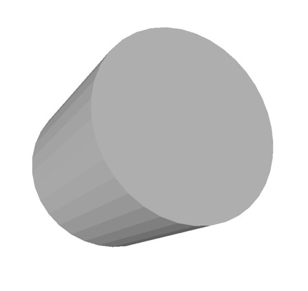
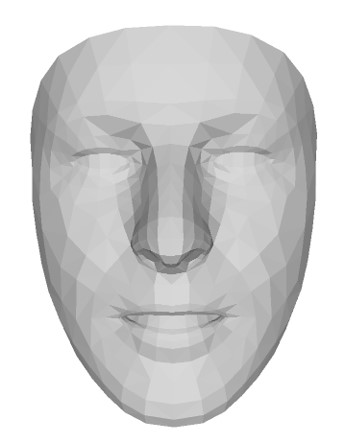
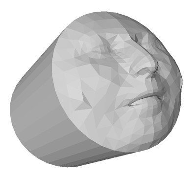
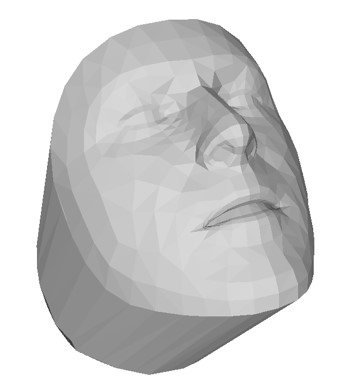

## Poisson Mesh Connecting
This repo is a partial implementation of [1] and focuses on merging/connecting functionality, as in Fig. 9, Fig. 11, and Fig. 12 of the paper.
Currently, naive Poisson (i.e., without scale and rotation consideration) is implemented.
However, similarity transform alignment for boundary correspondence is applied before constructing Poisson's equation.
This preprocess eases artifacts caused by scale and rotation up to some extent.

## Try
```
python test.py
```
will generate face to cylinder and cylinder to face connecting .obj.

||Pinned|Free|Merged|
|---|:---:|:---:|:---:|
|face to cylinder|   |  | 
|cylinder to face|  |   | 

`poisson_mesh_connecting()` is the main interface. In addition to pinned and free meshes, need to specify exactly the same number of boundary vertex correspondence.

### Reference
- [1] Yu, Y., Zhou, K., Xu, D., Shi, X., Bao, H., Guo, B., & Shum, H. Y. (2004). Mesh editing with poisson-based gradient field manipulation. In ACM SIGGRAPH 2004 Papers (pp. 644-651).